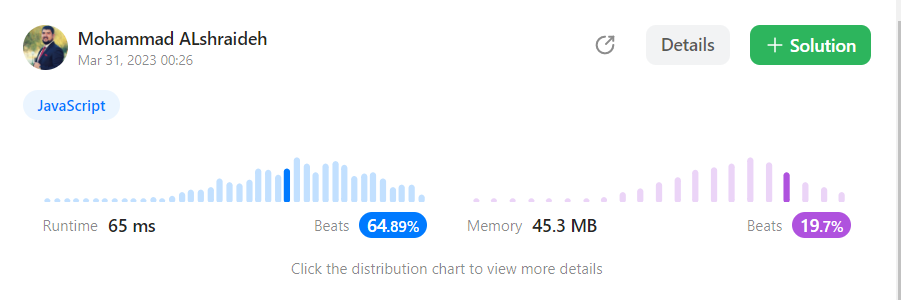

## Solution : 
```
var search = function (nums, target) {
  let min = 0;
  let max = nums.length - 1;
  if (nums[min] == target) return min;
  if (nums[max] == target) return max;
  while (min < max) {
    let mid = Math.floor(min + (max - min) / 2);
    if (nums[mid] == target) {
      return mid;
    } else if (nums[mid] < target) {
      //go right
      min = ++mid;
    } else {
      max = --mid;
    }
  }
  return -1;
};
```
## result on Leetcode : 


## Unit test file : [click here](binarySearch.test.js)

