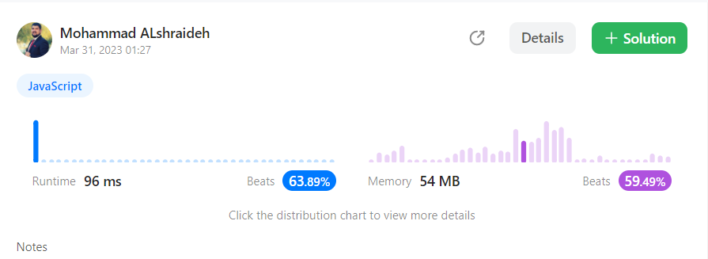

## Solutions : 

### 1- using has object approach
```js
var containsDuplicate = function(nums) {
  let hash ={}
  for(let i=0; i<nums.length ;i++){
    if(!hash[nums[i]]){
        hash[nums[i]]=1
    }else{
        hash[nums[i]]+=1
    }
    if(hash[nums[i]]==2)return true
  }
  return false
  
};
```

---

- The **time complexity** of this function is **O(n)** because it iterates over the input array once.
- The **space complexity** is also **O(n)** because the function uses a hash table to keep track of the frequency of each element in the array. The size of the hash table can be up to n in the worst case if all elements are unique.

---

## result on Leetcode : 



----

### 2- using Set()  approach

```js
var containsDuplicate = function(nums) {
  let set = new Set();
  for(let i=0; i<nums.length ;i++){
      if(set.has(nums[i])){
      return true;
    } else {
      set.add(nums[i]);
    }
  }
  return false;
};
```

----
- The **time complexity** of the second solution is **O(n)** because it iterates over the array once and performs constant time operations for each element.

- The **space complexity** of the second solution is also **O(n)** because it creates a set to store the unique elements in the array. The size of the set is at most n, where n is the length of the input array.

---

## result on Leetcode : 
.png)

---

## recourses : 
 [W3schools : how to use Set( ) in Javscript](https://www.w3schools.com/js/js_object_sets.asp)

 ---
## Unit test file : [click here](containsDuplicate.test.js)

