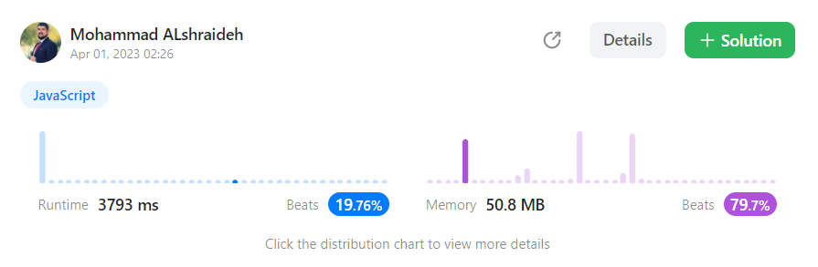
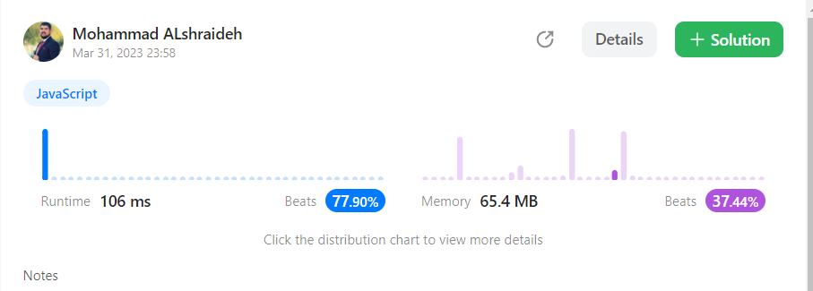

## Solutions : 

### 1-Two pass approach : (nested loop)
```js
var containsNearbyDuplicate = function(nums, k) {
    const n = nums.length;
  for (let i = 0; i < n; i++) {
      for (let j = i+1; j < Math.min(i+k+1, n); j++) {
          if (nums[i] === nums[j]) {
            if (Math.abs(i - j) <= k) {
              return true;
            }
              
          }
      }
  }
  return false;
};
```
- ***Time complexity*** : The time complexity of the given code is : **O(n*k)**,

   where n is the length of the input array nums and k is the second argument of the function.
  This is because the outer loop iterates n times, and for each iteration, the inner loop iterates up to k times.

- ***Space complexity*** :  The space complexity of the code is **O(1)**
because it uses a constant amount of extra space, 
regardless of the input size. This is because the code does not create any additional data structures or arrays.
## result on Leetcode : 

### 2-One pass approach : (using MAP)
```js
var containsNearbyDuplicate = function(nums, k) {
  const map = new Map();
  for (let i = 0; i < nums.length; i++) {
      if (map.has(nums[i]) && i - map.get(nums[i]) <= k) {
          return true;
      }
      map.set(nums[i], i);
  }

  return false;
};
```
- The ***time complexity*** of this code is **O(n)**,

   where n is the length of the input array nums.
 This is because the code uses a single loop to iterate over the array and performs constant-time operations (hash table lookups and insertions) for each element.

- The **space complexity** of this code is also **O(n)**,

  because it uses a hash table or Map to store at most n key-value pairs,
 where the key is an element in the input array and the value is the index of the last occurrence of the element. Therefore, the worst-case space complexity occurs when all the elements in the input array are distinct, and the hash table or Map needs to store n key-value pairs.
   ## result on Leetcode : 
   
## Unit test file : [click here](containsDuplicateII.test.js)

## references :
 [W3schools : how to use MAP in JavaScript ](https://www.w3schools.com/js/js_maps.asp)
