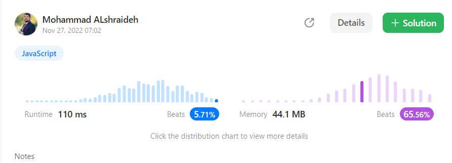

## Solution : 

```js
var fizzBuzz = function(n) {
    let newArray=[]
    for(let i=1 ;i<=n ;i++){
        if(i%5===0 && i%3===0){
            newArray.push("FizzBuzz")
            continue;
        }
        if(i%5===0){
            newArray.push("Buzz")
            continue;
        }
         if(i%3===0){
            newArray.push("Fizz")
             continue;
        }else{
            newArray.push(i.toString())
            continue;
        }
        
        
        
        
    }
    return newArray
};
```
---

- The **time complexity** of this code is **O(n)** because it contains a for loop that iterates n times, and each iteration is a constant time operation.

- The **space complexity** is also **O(n)** because it creates a new array of length n to store the results.

---

## result on Leetcode : 
   

---

Here's the unit test code for the `fizzBuzz` function:  [test file here](./fizzBuzz.test.js)
