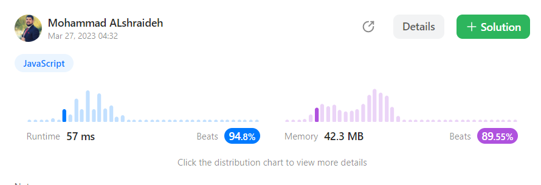

## Solution : 

```js
var isHappy = function(n) {
    // Create a new Set to keep track of seen numbers
   const prevSeenSum= new Set()
   // Continue looping until we reach 1 
    while(n != 1 ){
      let currentSum=0;
       while(n > 0 ){
         // Compute the sum of squares of current number's digits
            currentSum += (n %10) * (n %10)
             // Break down each digit of number 
             n =Math.floor(n /10 )
           }
           
             if(!prevSeenSum.has(currentSum)){
                // Add current number to seen set
              prevSeenSum.add(currentSum)
               n = currentSum
              }else{
                     return false
               }


        }
    return true
};
```
- The **time complexity** of this algorithm depends on the size of the input number n. Since in the worst case, the algorithm will continue to loop indefinitely, the time complexity is not **bounded**. However, in practice, the algorithm is expected to terminate in a reasonable time for most inputs.

- The **space complexity** of this algorithm is also **unbounded**, as the prevSeenSum Set may grow in size as more numbers are added to it. However, the maximum size of the set is bounded by the number of possible unique sums of squares of digits, which is limited by the size of the input number n. In practice, the space used by the set is expected to be small for most inputs

## result on Leetcode : 
   
Here's the unit test code for the `isHappy` function:  [test file here](./happyNumber.test.js)
