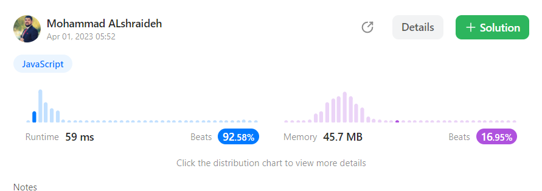

## Solutions: 

###  1-sum formula approach

```js
var missingNumber = function(nums) {
    const n = nums.length;
    let sum = (n * (n + 1)) / 2;
    let actualSum = nums.reduce((acc, curr) => acc + curr, 0);
    return sum - actualSum;
  };
```
----

- The **time complexity** of this approach is **O(n)**, where n is the length of the input array nums. 

- The **space complexity** of this approach is **O(1)**, which is constant and does not depend on the size of the input array.

   **This is the optimum solution**
---


## result on Leetcode : 
    
   
---
---
----

###  2-dictionary approach (Hash table)
```js


var missingNumber = function missingNumber(nums) {
    let hash = {};
    let max = 0;
    let min = Infinity;
    
    for (let i = 0; i < nums.length; i++) {
      if (max < nums[i]) {
        max = nums[i];
      }
      if (nums[i] < min) {
        min = nums[i];
      }
      hash[nums[i]] = true;
    }
  
    for (let j = 0; j < max; j++) {
      if (!hash[j]) {
        return j;
      }
    }
    
    return max + 1;
  };
```
----

- The **time complexity** of this approach is **O(n)**, where n is the length of the input array nums. 

- The **space complexity**  of this approach is **O(n)**, which is linear and depends on the size of the input array.
  This is because the function uses a hash table to store the numbers in the input array, and the size of the hash table is proportional to the length of the input array. 


---

## result on Leetcode : 
    

----

## references :
 [W3schools : how to use Reduce method in JavaScript ](https://www.w3schools.com/jsref/jsref_reduce.asp)

----

Here's the unit test code for the `missingNumber` function:  [test file ](./missingNumber.test.js)
