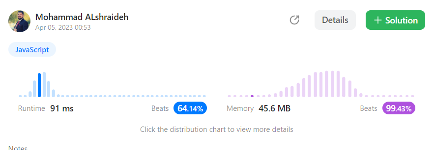

## Solution : 

----

```js
var moveZeroes = function(nums) {
  let i = 0; // next available index for non-zero elements
  for (let j = 0; j < nums.length; j++) {
    if (nums[j] !== 0) { // found a non-zero element
      nums[i] = nums[j]; // move it to the next available index
      i++;
     
    }
  }
  for (let j = i; j < nums.length; j++) {
    nums[j] = 0; // fill the rest of the array with zeros
  }
};
```
----

## Explanation : 
- This code defines a function moveZeroes that takes an array of integers nums as input.
  The function modifies the input array by moving all zeros to the end of the array
    while maintaining the relative order of non-zero elements.

- The function uses two pointers, i and j, to traverse the input array nums.
  The pointer i represents the next available index for non-zero elements,
    and the pointer j iterates over each element of nums.

- n the first loop, for each element at index j,
  the function checks if the element is non-zero using the condition nums[j] !== 0. If the element is non-zero,
  it is moved to the next available index at i using the assignment nums[i] = nums[j], and the value of i is incremented by 1.
  This loop ensures that all non-zero elements are moved to the beginning of the array, and their relative order is maintained.

- In the second loop, the function fills the rest of the array from index i to the end of the array with zeros.
  This step ensures that all zeros are moved to the end of the array.

- After both loops, the input array nums has all non-zero elements at the beginning of the array, followed by zeros at the end of the array.

---- 
- **Time complexity**:

    The time complexity of the function is **O(n)**,
      where n is the length of the input array nums.
The function loops through the array twice, but each loop is executed once and has O(n) time complexity.
The first loop moves all non-zero elements to the beginning of the array, and the second loop fills the rest of the array with zeros.

- **Space complexity**:

   The space complexity of the function is **O(1)**, 
   meaning that it uses a constant amount of extra space regardless of the size of the input array.
  The function modifies the input array in place, without using any additional data structures.
   The only extra space used is for the two pointers, i and j, which take up constant space.

-----

## result on Leetcode : 
   

---- 
Here's the unit test code for the `moveZeros` function:  [test file here](./moveZeros.test.js)
