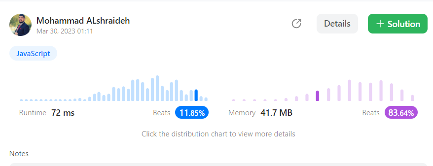
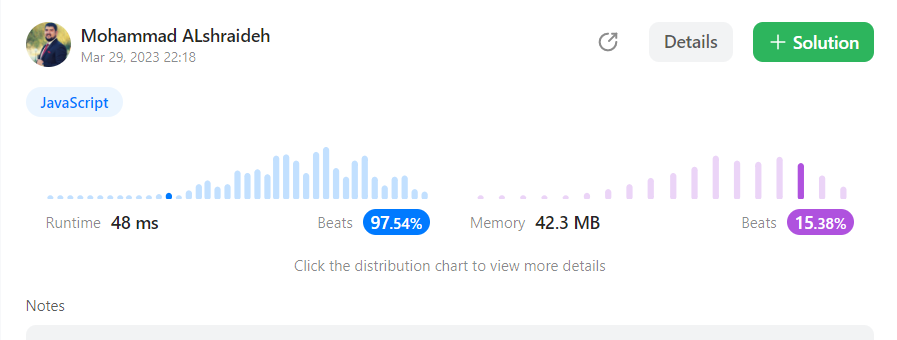

## Solutions :
---- 
```js
var plusOne = function(digits) {
    for (let i = digits.length - 1; i >= 0; i--) {
        if (digits[i] === 9) {
            digits[i] = 0;
        } else {
            digits[i]++;
            return digits;
        }
    }
    digits.unshift(1);
    return digits;
};
```


-------- 
### same approach but faster on leetcode test :


```js
var plusOne = function(digits) {
    if(digits.length==1){
        if(digits[0]==9){
             digits=[1,0]
            return digits
          }else{
                digits[0]+=1
            return digits
          }
       }
    if(digits[digits.length-1]==9){
        digits[digits.length-2]+=1
        digits[digits.length-1]=0
    }else{
        digits[digits.length-1]+=1
    }
for (let j = digits.length - 1 ; j > 0; j--) {
    if (digits[j]==10) {
        digits[j]=0
    digits[j-1]+=1
   }
}
if (digits[0]==10) {
    digits[0]=0
    digits.unshift(1) 
}
return digits
};
```
