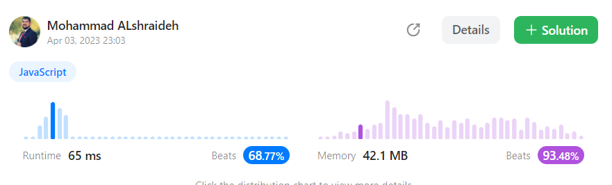
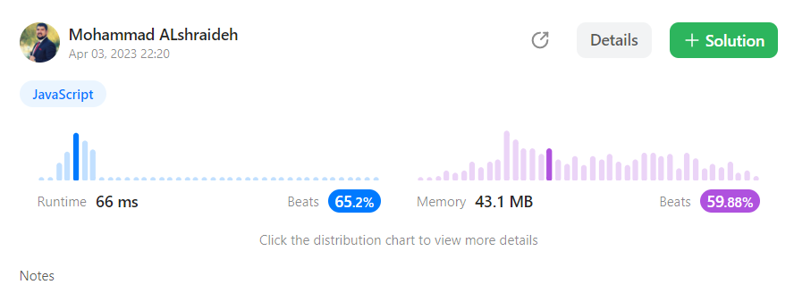
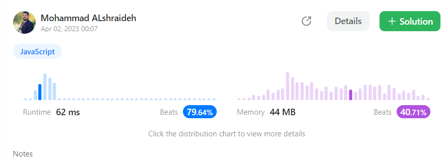

## Solutions :
---- 
###  1-XOR approach (optimum solution)
```js
var singleNumber = function(nums) {
  let ones = 0;
  let twos = 0;
  for (let i = 0; i < nums.length; i++) {
    ones = (ones ^ nums[i]) & ~twos;
    twos = (twos ^ nums[i]) & ~ones;
  }
  return ones| twos
};
```
- **Time Complexity: O(n)**,
  where n is the length of the input array.
 We iterate through each element in the array exactly once.

- **Space Complexity: O(1)**.
  We only use a constant amount of additional memory (the 'result' variable) regardless of the input size.

## result on Leetcode : 
   

-------- 

###  **2-** mathematical approach :
 -  that calculates the sum of all the numbers in the array and the sum of the distinct numbers in the array :


```js
var singleNumber = function(nums) {
    let sum = 0;
    let distinctSum = 0;
    
    for (let i = 0; i < nums.length; i++) {
        sum += nums[i];
    }
    
    let distinctNums = [...new Set(nums)];
    
    for (let i = 0; i < distinctNums.length; i++) {
        distinctSum += distinctNums[i];
    }
    
    return (3 * distinctSum - sum)/2
};

```
- The **time complexity** of this code is **O(n)**,
  where n is the length of the input array, because the code iterates through the input array twice, once to calculate the sum of all the numbers and once to calculate the sum of the distinct numbers.

- The **space complexity** of this code is also **O(n)**,
  because it creates a new array of distinct numbers using a set object, which could have a size of up to n in the worst case if all the elements in the input array are distinct.

## result on Leetcode : 
   
   
-----


### 3- hash table approach :


```js
var singleNumber = function (nums) {
  let hash = {};

  for (let i = 0; i < nums.length; i++) {
    if (!hash[nums[i]]) {
      hash[nums[i]] = 1;
    } else {
      hash[nums[i]] += 1;
    }
  }

  for (const key in hash) {
    if (hash[key] == 1) {
      return key;
    }
  }
};

```
----

- The **time complexity** of this code is **O(n)**,
  where n is the length of the input array, because the code iterates through the input array once to populate the hash table, and then iterates through the hash table to find the number with a frequency count of 1.


- The **space complexity** of this code is also **O(n)**,
  because the hash table could have up to n key-value pairs in the worst case if all the elements in the input array are distinct.
----


## result on Leetcode : 
   

## recourses : 
[Read about XOR approach](./XOR.md)

 [W3schools : how to use Set() in Javscript](https://www.w3schools.com/js/js_object_sets.asp)


Here's the unit test code for the `singleNumber` function:  [test file here](./singleNumberII.test.js)
