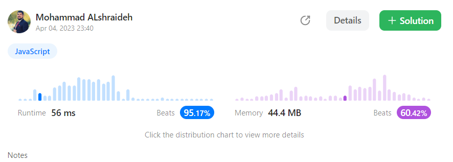

## Solutions :
---- 
###  1-XOR approach (optimum solution) developed Using ChatGPT
```js
var singleNumber = function (nums) {
let xorResult = 0;
  for (let i of nums) {
    xorResult ^= i;
  }
  
  // Find the rightmost set bit in the XOR result
  let rightmostSetBit = 0;
  while ((xorResult & (1 << rightmostSetBit)) === 0) {
    rightmostSetBit++;
  }
  
  let num1 = 0;
  let num2 = 0;
  
  // XOR all the numbers with the rightmost set bit
  for (let i of nums) {
    if ((i & (1 << rightmostSetBit)) === 0) {
      num1 ^= i;
    } else {
      num2 ^= i;
    }
  }
  
  return [num1, num2];
};
```
- **Time Complexity: O(n)**,
  where n is the length of the input array nums. This is because the implementation loops through the input array twice: once to compute the XOR result of all the numbers in the array, and once to separate the unique numbers using the rightmost set bit.
- **Space Complexity: O(1)**.
   because it uses only a constant amount of additional memory to store the variables xorResult, rightmostSetBit, num1, and num2. The amount of additional memory used does not depend on the length of the input array.

## result on Leetcode : 
   

-------- 


### 2- hash table approach :


```js
v var singleNumber = function (nums) {
  let hash = {};
let result=[]
  for (let i = 0; i < nums.length; i++) {
    if (!hash[nums[i]]) {
      hash[nums[i]] = 1;
    } else {
      hash[nums[i]] += 1;
    }
  }

  for (const key in hash) {
    if (hash[key] == 1) {
      result.push(parseInt(key)) ;
    }
  }
  return result
};
```
----

- The **time complexity** of this code is **O(n)**,
  where n is the length of the input array, because the code iterates through the input array once to populate the hash table, and then iterates through the hash table to find the number with a frequency count of 1.


- The **space complexity** of this code is also **O(n)**,
  because the hash table could have up to n key-value pairs in the worst case if all the elements in the input array are distinct.
----


## result on Leetcode : 
   


Here's the unit test code for the `singleNumber` function:  [test file here](./singleNumberIII.test.js)
