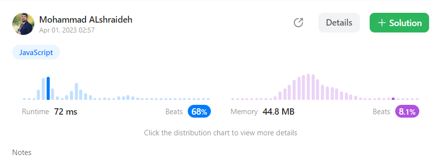
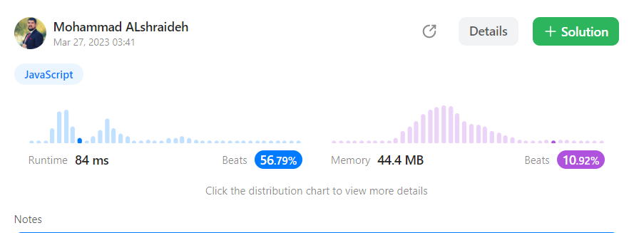
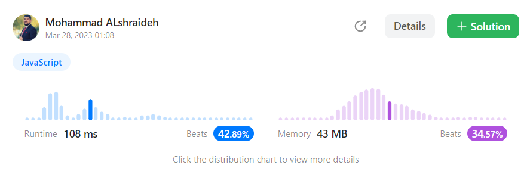

## Solutions :

 
### One pass approach 


```js
var twoSum = function(nums, target) {

    let hashMap={}

    for(let i=0;i<nums.length ;i++){

        let completment =target-nums[i]

           if(completment in hashMap){

            return [ hashMap[completment],i]

               }

            hashMap[nums[i]]=i

            }
    };
```
- The **time complexity** of the given code is **O(n)**,
  where n is the length of the input array nums. This is because the code uses a single loop to iterate over the array,
   and for each element, it performs constant-time hash table lookups and insertions.
- The **space complexity** of the given code is **O(n)**, where n is the length of the input array nums. This is because the code creates a hash table that can potentially store all the elements in the input array along with their indices.

  In the worst case, where there is no pair of elements that add up to the target, the hash table will store all the elements in the input array, and hence it will take up O(n) space. 
  
## result on Leetcode : 
   
-----
### Two pass approach 


```js
var twoSum = function(nums, target) {
    let hashMap={}
       for(let i=0;i<nums.length ;i++){

        hashMap[nums[i]]=i
           }

       for(let i=0;i<nums.length ;i++){

          let completment =target-nums[i]

            if(hashMap[completment] && hashMap[completment] !=i){

            return [i , hashMap[completment]]

            }

          }
    };
```
- The **time complexity** of the given code is**O(n)**, where n is the length of the input array nums. This is because the code uses two loops to iterate over the input array, each taking O(n) time complexity.

  The first loop iterates over each element in the input array and stores it in a hash table along with its index. This loop takes **O(n)** time complexity.

  The second loop also iterates over each element in the input array and checks if its complement (i.e., target - nums[i]) is in the hash table. This loop takes **O(n)** time complexity as well.

**Therefore, the overall time complexity of the code is O(n) + O(n) = O(n).**

- The **space complexity** of the given code is also **O(n)**. This is because the code uses a hash table to store all the elements of the input array along with their indices. In the worst case, where all elements of the input array are distinct, the hash table will store n key-value pairs, and hence it will take up **O(n)** space.
## result on Leetcode : 
   
-----
### BRUTE FORCE approach

- time complexity : O(N^2)

```js
var twoSum = function(nums, target) {
         
       for(let i=0;i<nums.length ;i++){
         
          for(let j=i+1;j<nums.length ;j++){
          
              if(nums[i]+nums[j]==target){

              return [i , j]

              }
            }
          }
          return null
};
```
- The **time complexity** of the given code is **O(n^2)**, where n is the length of the input array nums. This is because the code uses two nested loops to iterate over all possible pairs of elements in the input array, each taking O(n) time complexity.

  The outer loop iterates over each element in the input array, and the inner loop iterates over all the remaining elements in the input array. Therefore, the total number of iterations of the inner loop is (n-1) + (n-2) + ... + 1 = n(n-1)/2, which is O(n^2) in the worst case.

- The **space complexity** of the given code is**O(1)**, which means that the code uses a constant amount of memory. This is because the code does not use any extra data structures to store the input array or any intermediate results.
## result on Leetcode : 
   

Here's the unit test code for the `twoSum` function:  [test file here](./twoSum.test.js)
